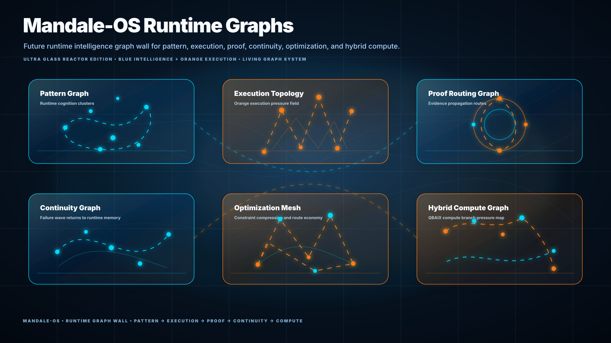

<p align="center">
  
</p>

<h1 align="center">Mandale-OS Runtime Ecosystem</h1>

<p align="center">
  <b>Runtime Intelligence Civilization</b><br>
  Pattern cognition • Execution routing • Proof intelligence • Continuity runtime • Hybrid compute orchestration
</p>

<p align="center">


</p>

---
### 🌌 What is Mandale-OS?
Mandale-OS is a **runtime intelligence ecosystem** exploring a future where execution systems become:

* 🧠 pattern-aware
* 🔀 routing-aware
* 📡 proof-aware
* ♻️ reuse-aware
* 🛡️ continuity-aware
* ⚡ consequence-aware

Traditional systems repeatedly execute workloads as isolated events.

Mandale-OS investigates whether execution systems can instead:

```text
UNDERSTAND → ROUTE → EXECUTE → PROVE → CONTINUE
```

The ecosystem combines:

* execution memory
* runtime topology
* proof intelligence
* pattern graph systems
* continuity runtime behavior
* hybrid compute orchestration
* execution reuse research

---
### 🧭 Core Runtime Doctrine

```text
Execution does not always need to start from zero.
```
Mandale-OS explores whether known execution structures can be:

* recognized
* routed
* reused
* verified
* evolved

instead of recomputed blindly.

---
## ⚙️ Runtime Civilization Flow

```text
INPUT
  ↓
PATTERN
  ↓
ROUTING
  ↓
EXECUTION
  ↓
PROOF
  ↓
CONTINUITY
  ↓
EVOLUTION
```

---
### 🌐 Runtime Ecosystem Surface

<p align="center">
  
</p>

Mandale-OS combines multiple runtime-intelligence layers into one ecosystem.

| Layer                 | Purpose                                         |
| --------------------- | ----------------------------------------------- |
| 🧠 Pattern Cognition  | Structural understanding and intent recognition |
| 🔀 Runtime Routing    | Intelligent execution direction                 |
| ⚡ Execution Reactor   | Signature-aware workload execution              |
| 📡 Proof Layer        | Verification and measurable evidence            |
| ♻️ Continuity Runtime | Runtime persistence and survivability           |
| 🚀 Optimization Layer | Reuse and execution efficiency                  |
| 🖥️ QBAIX Compute     | Commercial hybrid compute branch                |

---
### ⚡ Execution Memory Reactor (MEE)

<p align="center">
  
</p>

M-OS MEE (Execution Memory Reactor) is the **execution-proof branch** of the ecosystem.

It investigates whether runtime systems can remember structural workload patterns and route repeated execution toward reusable pathways.

```text
RUN → SIGNATURE → ROUTE → REUSE → PROVE
```

MEE explores:

* 🧩 signature routing
* 🧠 execution memory persistence
* 🔁 structural reuse
* 📡 proof-state transitions
* 📊 measurable reuse evidence
* ⚡ consequence-aware execution

---
### 🕸️ Runtime Graph Intelligence

<p align="center">
  
</p>

Mandale-OS treats runtime graphs as a **system language**.

The graph layer investigates:

| Graph                    | Meaning               |
| ------------------------ | --------------------- |
| 🧠 Pattern Graph         | Intent recognition    |
| 🔀 Routing Graph         | Execution pathways    |
| 📡 Proof Graph           | Evidence movement     |
| ♻️ Continuity Graph      | Runtime survivability |
| 🖥️ Hybrid Compute Graph | QBAIX orchestration   |

---
### 🌌 Runtime Topology

<p align="center">
  
</p>

The topology layer visualizes how runtime systems evolve through:

* intent
* memory
* routing
* execution
* proof
* continuity
* optimization

rather than isolated stateless execution.

---
### 🏛️ Runtime Architecture

<p align="center">
  
</p>

Mandale-OS architecture connects:

```text
Pattern Cognition
        ↓
Runtime Routing
        ↓
Execution Reactor
        ↓
Proof Intelligence
        ↓
Continuity Runtime
        ↓
Optimization Layer
        ↓
QBAIX Compute Branch
```

---
### 📊 Benchmark + Proof Layer

Mandale-OS includes measurable execution-proof experiments inherited from the original MEE branch.

The benchmark layer investigates:

* reuse detection
* signature recall
* persistence behavior
* routing confidence
* proof-state generation
* structural execution similarity

### Example measured surfaces

| Signal                | Example    |
| --------------------- | ---------- |
| 🔁 Reuse Match        | 88–91%     |
| 📡 Recall Stability   | High       |
| ⚡ Saved Time          | Measurable |
| 🧠 Routing Confidence | Stable     |
| 📋 Failure Cases      | Documented |

---
## 🖥️ QBAIX Compute Branch

<p align="center">
  
</p>

QBAIX represents the **commercial hybrid-compute realization branch** connected to Mandale-OS runtime intelligence.

QBAIX focuses on:

* AI-ready infrastructure
* accelerator-aware execution
* runtime-driven orchestration
* CPU/GPU integration
* hybrid compute systems
* infrastructure-scale execution surfaces

### Relationship

```text
Mandale-OS = Runtime Intelligence Layer

QBAIX = Compute Realization Layer
```

---
### 🎛️ Visual Runtime Surface

<p align="center">
  
</p>

The visual ecosystem explores runtime systems as:

* reactor civilizations
* execution nervous systems
* topology networks
* runtime constellations
* continuity-aware infrastructure
* proof-routing surfaces

---
### 🧪 Interactive Demo Surface

```text
demo/Mandale-OS-demo.html
```

The demo surface combines:

* 🌌 ecosystem visualization
* 🧠 runtime doctrine
* 🕸️ topology graphs
* ⚡ execution lifecycle surfaces
* 🖥️ QBAIX compute mapping
* 📡 proof-routing concepts

---
### 🗂️ Repository Structure

```bash
mos_repo_runtime/
│
├── benchmarks/
├── demo/
├── docs/
│   ├── assets/
│   │   └── SVG/
│   │       ├── *.svg
│   │       ├── *.gif
│   │
│   ├── architecture.md
│   ├── adapter_api.md
│   ├── pstg_model.md
│   └── ...
│
├── examples/
├── mos/
├── reports/
├── research/
├── tests/
│
├── README.md
├── requirements.txt
└── pyproject.toml
```

---
### 🔭 Relation to Broader Ecosystem

```text
Mandale-OS
    ↓
Pattern Runtime
    ↓
Execution Memory Reactor
    ↓
Proof Intelligence
    ↓
Continuity Runtime
    ↓
QBAIX Hybrid Compute
```

---
## ❌ What this is NOT

Mandale-OS is NOT:

* a Windows/Linux replacement
* a finished operating system
* a production scheduler
* a finalized AI runtime
* a benchmark claim against enterprise systems

This repository is a **runtime research ecosystem**.

---

## ✅ What this IS

Mandale-OS IS:

* 🧠 a runtime intelligence research surface
* ⚡ a pattern-routing ecosystem
* 🔁 an execution-memory exploration system
* 📡 a proof-runtime architecture
* ♻️ a continuity-aware runtime direction
* 🖥️ a hybrid compute orchestration concept
* 🌌 a visual runtime civilization

---

# 👨‍💻 Research Identity

## Raaj Mandale

Founder & Systems Architect
Eranest Technoware Pvt Ltd

### Research Domains

* Mandale-OS
* QBAIX
* XPADI
* Runtime Systems
* Survivability Infrastructure
* Execution Intelligence
* Hybrid Compute Architecture

---
### 🔗 Research Links

| Surface  | Link                                     |
| -------- | ---------------------------------------- |
| GitHub   | https://github.com/raajmandale           |
| ORCID    | https://orcid.org/0009-0005-9810-1655    |
| Wikidata | https://www.wikidata.org/wiki/Q139570902 |
| OpenAlex | https://openalex.org/A5127026877         |
| Zenodo   | https://zenodo.org/communities/qbaix     |

---

## 📚 Citation

```bibtex
@software{mandale_runtime_ecosystem_2026,
  author = {Raaj Mandale},
  title = {Mandale-OS Runtime Ecosystem},
  year = {2026},
  url = {https://github.com/raajmandale},
  version = {Research Runtime Surface}
}
```

---
# 📜 License

MIT
