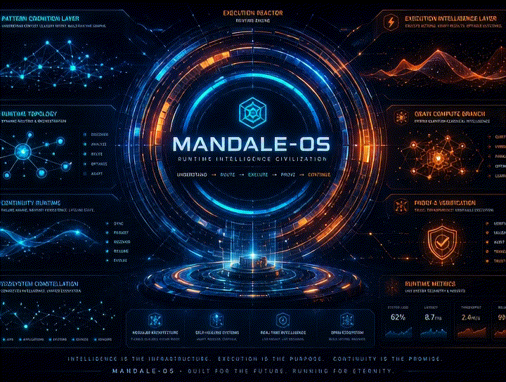
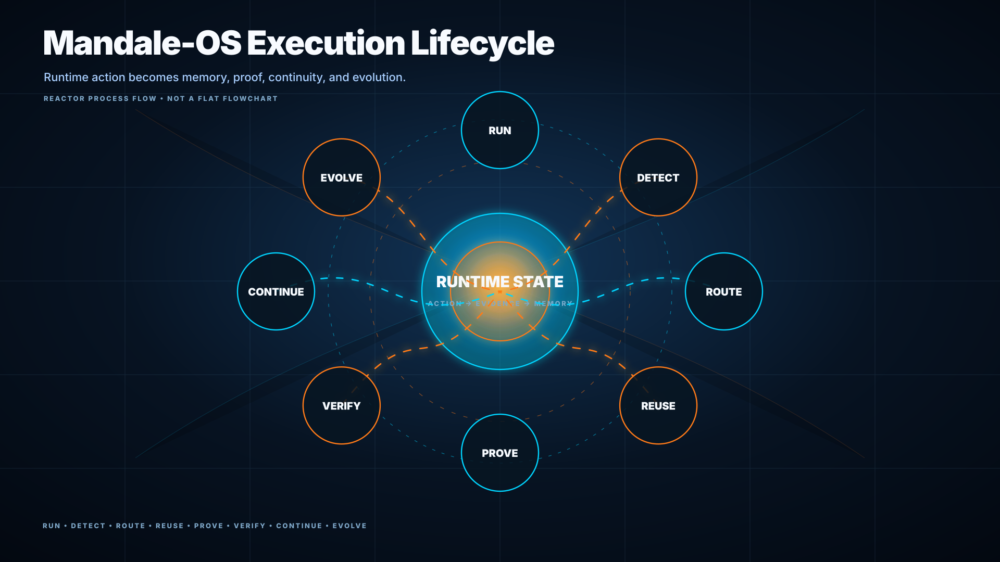
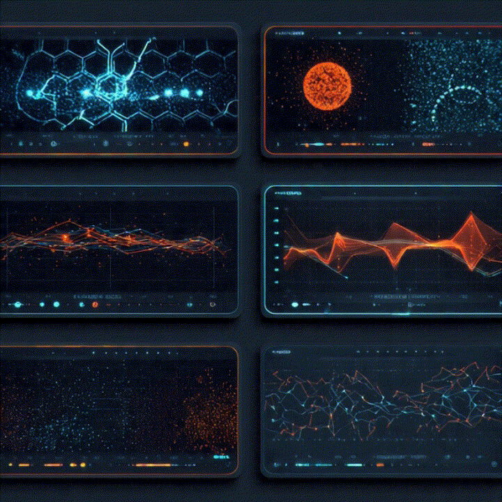
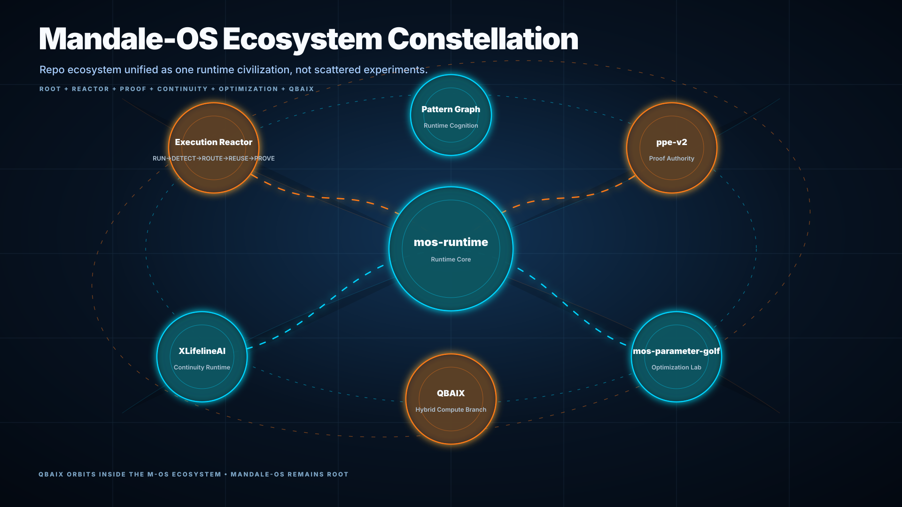

<p align="center">
  
</p>

---

<h1 align="center">🌌 Mandale-OS</h1>

<p align="center">
  <b>Runtime Intelligence Ecosystem</b><br>
  Pattern Cognition • Execution Memory • Proof Intelligence • Continuity Runtime • QBAIX Hybrid Compute
</p>

---

<div align="center">

[](https://github.com/raajmandale/mandale-os)
[](https://raajmandale.github.io/mandale-os/demo/Mandale-OS-demo.html)
[](https://github.com/raajmandale/mandale-os)
[](https://raajmandale.in)

<br>

[](https://github.com/raajmandale/mandale-os)
[](https://github.com/raajmandale/mos-mee-execution-reactor/tree/ppe-v2)
[](https://github.com/raajmandale/M-OS_PPE)
[](https://github.com/raajmandale/mos-parameter-golf)
[](https://github.com/raajmandale/XLifelineAI)

</div>

---
# 🌐 Runtime Civilization Surface

| Surface | Link |
|---|---|
| 🚀 Runtime Demo Surface | https://raajmandale.github.io/mandale-os/demo/ |
| 👤 Founder Website | https://raajmandale.in |
| 🧠 ORCID | https://orcid.org/0009-0005-9810-1655 |
| 📚 Wikidata | https://www.wikidata.org/wiki/Q139570902 |
| 🔬 OpenAlex | https://openalex.org/A5127026877 |
| 📄 Zenodo Research | https://zenodo.org/communities/qbaix |
| 💻 GitHub Profile | https://github.com/raajmandale |

---
## 🧩 Related M-OS Ecosystem Repositories

| Repository | Runtime Branch |
|---|---|
| ⚡ [mandale-os](https://github.com/raajmandale/mandale-os) | Root Runtime Intelligence Ecosystem |
| 🧠 [mos-mee-execution-reactor / PPE-v2](https://github.com/raajmandale/mos-mee-execution-reactor/tree/ppe-v2) | Execution Memory Reactor + Proof Branch |
| 🔬 [M-OS PPE — Pattern Proof Engine](https://github.com/raajmandale/M-OS_PPE) | Proof Runtime Branch |
| 🧬 [mos-parameter-golf](https://github.com/raajmandale/mos-parameter-golf) | Runtime Optimization Research |
| 🌐 [XLifelineAI](https://github.com/raajmandale/XLifelineAI) | Continuity Runtime Research |

---

# 🌌 What is Mandale-OS?

**Mandale-OS** is a runtime intelligence ecosystem exploring a future where execution systems can:

- understand
- route
- reuse
- prove
- continue
- evolve

instead of treating every workload as isolated and stateless.

---

# 🧬 Core Runtime Doctrine

```text
UNDERSTAND → ROUTE → EXECUTE → PROVE → VERIFY → CONTINUE → EVOLVE
```

Mandale-OS is **not**:

- a Linux replacement
- a Windows replacement
- a consumer operating system

Mandale-OS **is**:

- a runtime intelligence research ecosystem
- a pattern-routing runtime direction
- an execution-memory exploration system
- a proof-runtime architecture
- a continuity-aware runtime layer
- a hybrid compute orchestration concept

---

# 🧠 Runtime Philosophy

Traditional runtimes repeatedly execute workloads from zero.

Mandale-OS investigates whether a runtime can:

- recognize repeated execution structures
- route known workload families
- reuse execution memory
- generate proof-state transitions
- continue under failure
- evolve from prior execution patterns

---

# 🏛️ Runtime Architecture

<p align="center">
  
</p>

---

## Runtime Flow

```text
Intent
  ↓
Pattern Cognition
  ↓
Runtime Routing
  ↓
Execution Reactor
  ↓
Proof Intelligence
  ↓
Continuity Runtime
  ↓
Optimization Layer
  ↓
QBAIX Compute Branch
```

---
### ⚡ Execution Memory Reactor

<p align="center">
  
</p>

The original **M-OS MEE — Execution Memory Reactor** remains the proof-engine core of this ecosystem.

---
## Reactor Flow

```text
RUN → SIGNATURE → ROUTE → REUSE → PROVE
```

---
## Research Areas

- signature-driven workload routing
- execution memory persistence
- structural reuse detection
- proof-state transitions
- benchmark evidence generation

---
## Reactor Flow

```text
RUN → SIGNATURE → ROUTE → REUSE → PROVE
```

---

## Research Areas

- signature-driven workload routing
- execution memory persistence
- structural reuse detection
- proof-state transitions
- benchmark evidence generation

---

# 🕸️ Runtime Graph Intelligence

<p align="center">
  
</p>

Mandale-OS treats runtime graphs as the system language.

---

| Graph | Meaning |
|---|---|
| Pattern Graph | Intent recognition and structural similarity |
| Routing Graph | Execution pathway selection |
| Proof Graph | Evidence and verification movement |
| Continuity Graph | Runtime survivability and persistence |
| Hybrid Compute Graph | QBAIX compute orchestration |

---

# ⚡ Runtime Benchmark Surfaces

Mandale-OS explores runtime execution behavior through:

- execution pressure mapping
- routing density analysis
- graph topology evolution
- execution reuse pathways
- continuity pressure systems
- proof verification movement
- hybrid compute orchestration

<p align="center">
  
</p>

---

## Benchmark Domains

| Domain | Purpose |
|---|---|
| Execution Pressure | Runtime pathway stress observation |
| Routing Density | Structural execution pathway mapping |
| Runtime Reuse | Signature-based workload reuse |
| Continuity Runtime | Failure persistence exploration |
| Proof Routing | Verification and evidence movement |
| Hybrid Compute | QBAIX compute orchestration |

---

# 🌐 Ecosystem Constellation

<p align="center">
  
</p>

Mandale-OS connects multiple runtime research branches into one ecosystem.

---

| Layer | Role |
|---|---|
| Mandale-OS | Root runtime intelligence ecosystem |
| MEE | Execution memory reactor |
| PPE-v2 | Proof and verification branch |
| XLifelineAI | Continuity runtime branch |
| mos-parameter-golf | Optimization research |
| QBAIX | Commercial hybrid compute branch |

---

# 🖥️ QBAIX Compute Branch

<p align="center">
  
</p>

QBAIX represents the commercial compute realization branch connected to Mandale-OS.

---

## Relationship

```text
Mandale-OS = Runtime Intelligence Layer
QBAIX      = Commercial Hybrid Compute Branch
```

---

# 📊 Benchmark + Proof Layer

The original MEE branch includes benchmark and proof surfaces for:

- routing benchmark
- reuse metrics
- signature recall
- persistence trials
- failure cases
- benchmark evidence

---

## Example Proof Signals

| Signal | Example |
|---|---|
| Reuse Match | 88–91% |
| Saved Time | Measurable |
| Recall | Stable |
| Confidence | High |
| Failure Cases | Documented |

---
### 🚀 Demo Surface

<div align="center">

[](https://raajmandale.github.io/mandale-os/demo/)

</div>

---
The cinematic runtime demo explains:

- Mandale-OS doctrine
- runtime architecture
- execution lifecycle
- runtime graph intelligence
- ecosystem constellation
- QBAIX compute relation
- founder/research identity

---
## Demo Explains

- Mandale-OS doctrine
- architecture ecosystem
- runtime graph intelligence
- execution lifecycle
- QBAIX compute relation
- founder/research identity

---
# 🎬 Visual Runtime Assets

All cinematic runtime assets are stored under:

```text
docs/assets/SVG/
```
---

<p align="center">
  
</p>

---
<div align="center">

[](docs/assets/SVG/)
[](https://github.com/raajmandale/mandale-os/tree/main/docs/assets/SVG)
[](https://github.com/raajmandale/mandale-os/blob/main/docs/assets/SVG/mandale-os-runtime-graphs.gif)

</div>

---
Includes:

- runtime topology graphs
- execution lifecycle reactors
- runtime graph intelligence motion
- ecosystem constellation visuals
- QBAIX compute motion surfaces
- cinematic runtime GIF demonstrations

---
These assets serve as:

- runtime visualization layers
- benchmark presentation surfaces
- architecture storytelling media
- execution topology explainers
- public research presentation assets
- ecosystem identity surfaces

---
<div align="center">

[](docs/assets/SVG/)
[](docs/assets/SVG/05_Mandale-OS_Runtime_Graphs.svg)
[](docs/assets/SVG/mandale-os-runtime-graphs.gif)

</div>

---
## 🗂️ Repository Structure

```text
mandale-os/
│
├── benchmarks/
├── demo/
│   └── index.html
│
├── docs/
│   ├── assets/
│   │   └── SVG/
│   │
│   ├── architecture.md
│   ├── adapter_api.md
│   ├── pstg_model.md
│   └── ...
│
├── examples/
├── mos/
├── reports/
├── research/
├── tests/
│
├── README.md
├── requirements.txt
└── pyproject.toml
```

---

# 🛰️ Research Position

Mandale-OS is an exploratory runtime intelligence ecosystem.

The project investigates:

- execution memory systems
- pattern-aware runtime routing
- continuity-aware execution
- proof-state runtime systems
- topology-driven execution graphs
- hybrid compute orchestration

This repository represents a public research and ecosystem surface, not a finalized production runtime.

---

# 👨‍💻 Founder & Research Direction

## Raaj Mandale

Founder & Systems Architect  
Eranest Technoware Pvt Ltd

---

## Research Domains

- Runtime Intelligence
- Pattern Execution
- Execution Memory
- Continuity Systems
- Proof Runtime
- Hybrid Compute
- AI Infrastructure
- Cyber Survivability

---

# 📚 Citation

```bibtex
@software{mandale_os_runtime_ecosystem_2026,
  author = {Raaj Mandale},
  title = {Mandale-OS: Runtime Intelligence Ecosystem},
  year = {2026},
  url = {https://github.com/raajmandale/mandale-os},
  note = {Runtime intelligence research ecosystem integrating execution memory, proof intelligence, continuity runtime, and QBAIX hybrid compute}
}
```

---

# 📜 License

MIT

---

<p align="center">
<b>Mandale-OS</b><br>
Intelligence is the infrastructure.<br>
Execution is the purpose.<br>
Continuity is the promise.
</p>

<p align="center">


</p>