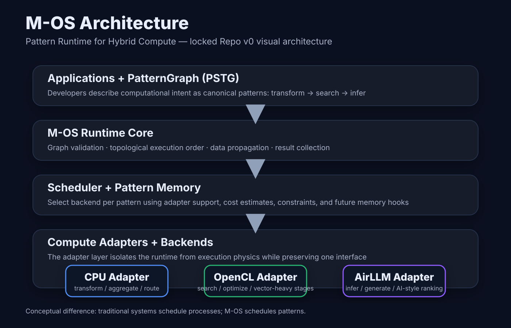
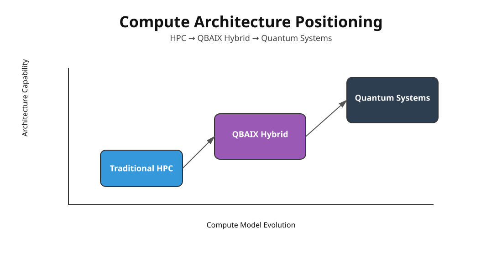
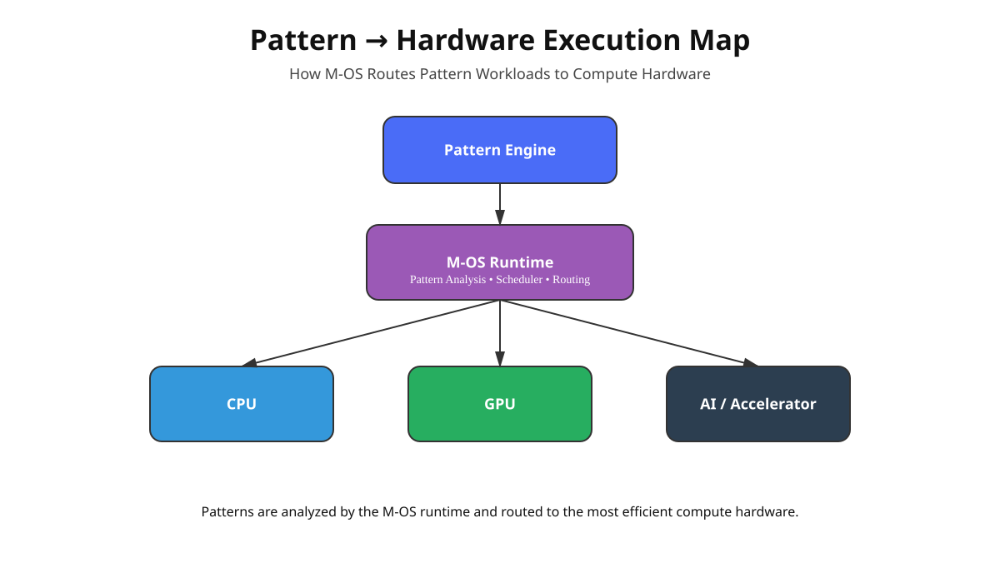
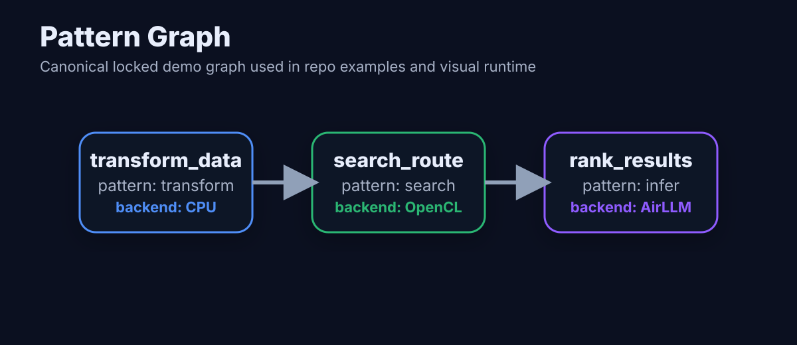
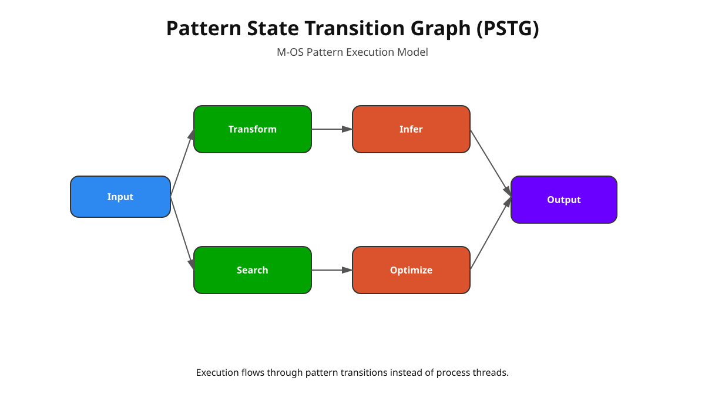
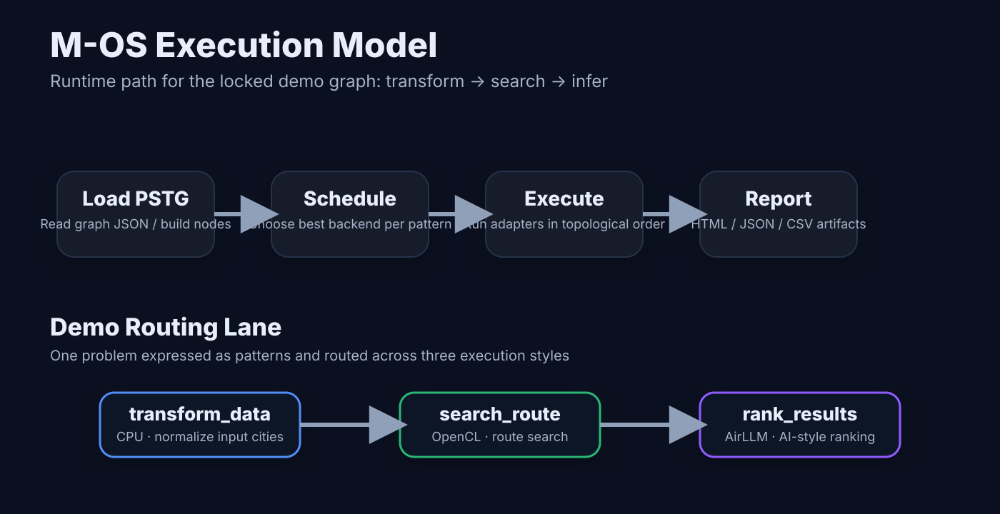
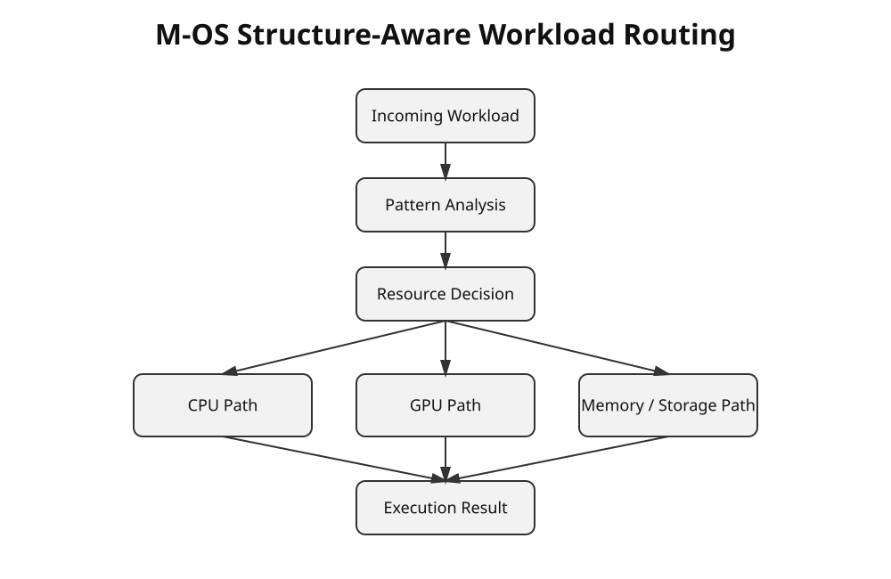
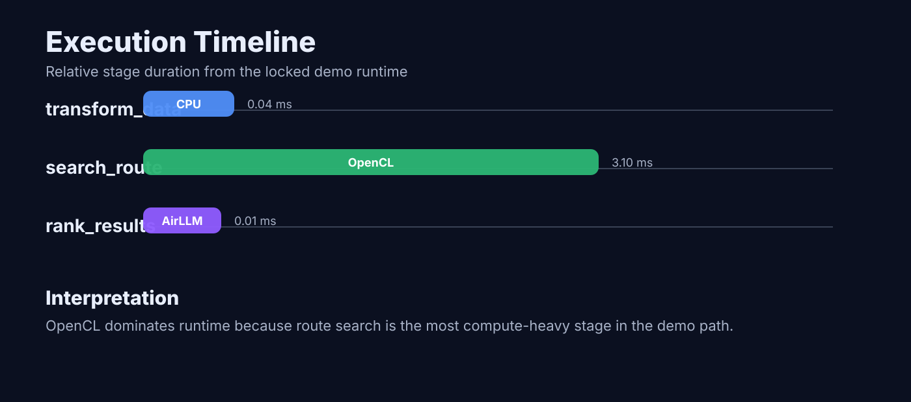

  

<h1 align="center">M-OS</h1>

<b>Pattern Runtime for Hybrid Compute</b> 
Deterministic execution for CPU / GPU / AI compute pipelines

---

# What is M-OS

M-OS is a **pattern-based runtime system** designed to execute complex computation in a structured and deterministic way.

Instead of writing long procedural pipelines, M-OS represents computation as **patterns connected in a graph**.

Think of it like:

Traditional systems  
→ execute commands step-by-step

M-OS  
→ executes **structured patterns of computation**

This approach makes large compute systems easier to reason about and reproduce.

---

# Why This Matters

Modern compute systems (AI, HPC, simulation) suffer from:

- complex pipeline orchestration  
- unpredictable execution order  
- hardware-specific implementations  
- difficulty reproducing results  

M-OS introduces a new model where computation is expressed as **Pattern Graphs**.

This enables:

✔ deterministic execution  
✔ hardware-agnostic compute routing  
✔ reproducible workflows  
✔ structured optimization pipelines  

---

# 🌐 Compute Landscape

The M-OS runtime is designed to operate within modern **hybrid compute architectures**.

Traditional HPC systems rely on CPU/GPU clusters with imperative scheduling.  
M-OS introduces a **pattern-driven runtime layer** that enables structured execution across heterogeneous compute hardware.

---

## 🚀 60-Second Quickstart

Get M-OS running in less than a minute.

### 1. Clone the repository

git clone https://github.com/raajmandale/mos-runtime.git

cd mos-runtime

### 2. Install dependencies

pip install -r requirements.txt

### 3. Run the demo

python cli/mos.py run examples/graph_opt.yaml

### Example Output

PatternGraph loaded
Nodes: 12
Execution backend: CPU

Running scheduler...
Executing nodes...

Transform ✓
Search ✓
Optimize ✓
Simulate ✓
Aggregate ✓

Execution complete
Runtime: 0.42s

---

# 🧠 Architecture

M-OS is built as a layered runtime architecture.

| Layer | Responsibility |
|------|---------------|
| PatternGraph | describes computation patterns |
| Runtime | executes graph nodes |
| Scheduler | determines execution order |
| Adapter | connects runtime to hardware |
| Backend | CPU / GPU / AI compute |

---

# 🧩 Pattern → Hardware Execution

M-OS does not schedule processes.

Instead, it schedules **patterns of computation**.

The runtime analyzes the structure of a workload and routes execution to the most appropriate compute hardware:

• CPU  
• GPU  
• AI accelerators  

This enables flexible execution across heterogeneous compute environments.

---

# 🔗 Pattern Graph Example

Example execution pattern:

Transform → Search → Optimize → Simulate → Aggregate

Each stage becomes a node in the **PatternGraph**, allowing the runtime to schedule execution deterministically.

---

# 🔬 Pattern State Transition Graph

Execution inside M-OS moves through **pattern state transitions** rather than traditional process threads.

Each node represents a transformation of computational state that progresses toward a solution.

---

# ⚙️ Execution Flow

Runtime pipeline:

PatternGraph  
↓  
Scheduler  
↓  
Runtime  
↓  
Adapter  
↓  
Backend Compute

---

# 🔀 Workload Routing

The runtime analyzes incoming workloads and determines where they should execute.

Routing decisions depend on the **structure of the pattern graph**, not just static hardware configuration.

---

# ⏱ Execution Timeline

This timeline illustrates how multiple pattern nodes are executed across runtime stages.

---

# 📂 Project Structure

mos-runtime
│
├ core/
│ ├ pattern_graph
│ ├ runtime
│ └ scheduler
│
├ adapters/
│ ├ cpu
│ ├ opencl
│ └ ai
│
├ examples/
├ docs/
│ └ assets/svg
│
└ cli/

---

# 🔍 Why Pattern-Based Runtime

Traditional compute systems are:

• imperative  
• hardware-specific  
• difficult to reproduce  

M-OS introduces:

• pattern-driven execution  
• deterministic runtime graphs  
• portable compute routing  

This model works well for:

• AI pipelines  
• HPC workflows  
• optimization engines  
• simulation systems

---

# 🗺 Roadmap

Current stage

v0 — Pattern Runtime Core

Next stages

v1 — Distributed scheduler
v2 — GPU execution backend
v3 — AI runtime adapters
v4 — Hybrid compute orchestration

---

# 📊 Status

Research prototype.  
Architecture baseline locked under **M-OS v0**.

---

# 👤 Author

Raaj Mandale  
Founder — ERANEST Technoware Pvt Ltd

---

# 📄 License

MIT License

---

# 📚 Citation

If you use M-OS in research:

@software{mandale_mos_runtime_2026,
author = {Raaj Mandale},
title = {M-OS: Pattern Runtime for Hybrid Compute},
year = {2026},
url = {https://github.com/raajmandale/mos-runtime}
,
version = {v0.1}
}